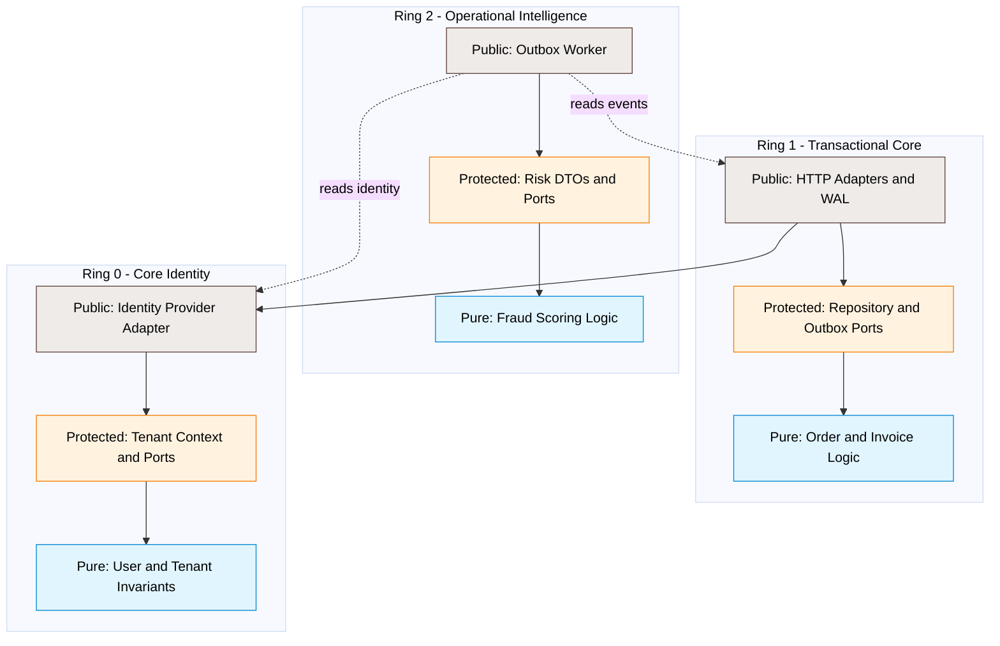
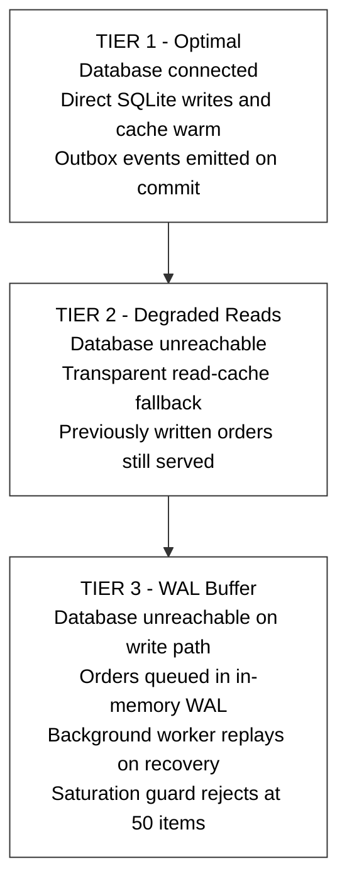
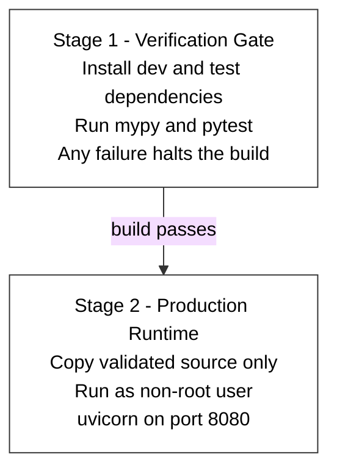

# py-monolith-showcase

[Python](https://www.python.org/)
[FastAPI](https://fastapi.tiangolo.com/)
[Architecture](https://github.com/bdra-io/bdra-spec)
[Mypy](https://mypy-lang.org/)
[Tests](https://pytest.org/)
[Docker](https://www.docker.com/)

> **A production-grade reference application demonstrating Business-Domain Ring Architecture (BDRA Lite) in modern Python.**

This repository showcases how to solve complex distributed systems problems — **multi-tenancy**, **asynchronous event streaming**, **zero-downtime write buffering**, and **real-time fraud analysis** — using a clean, high-signal modular monolith. It is a **blueprint for enterprise teams** who want compiled-language rigor without leaving the Python ecosystem: strict ring boundaries, full static type safety, native multi-tenant isolation, mid-flight infrastructure resiliency, and out-of-band operational intelligence — all orchestrated through **FastAPI**, **asyncio structured concurrency**, and a zero-mock test matrix.

[BDRA Architecture Gate](https://github.com/bdra-io/bdracheck) · [BDRA Specification](https://github.com/bdra-io/bdra-spec) · [Go Reference Implementation](https://github.com/bdra-io/go-monolith-showcase)

---

## Table of Contents

- [Architectural Blueprint: BDRA Lite](#architectural-blueprint-bdra-lite)
- [Enterprise Pillars Demonstrated](#enterprise-pillars-demonstrated)
- [Multi-Tier Fault Matrix](#multi-tier-fault-matrix)
- [The Three-Step Developer Workflow](#the-three-step-developer-workflow)
- [Inline Architecture Escape Valves](#inline-architecture-escape-valves)
- [Python Enforcement Layer](#python-enforcement-layer)
- [Project Structure](#project-structure)
- [API Surface](#api-surface)
- [Getting Started](#getting-started)
- [Validation & Testing](#validation--testing)
- [Developer Tooling (`bdracheck`)](#developer-tooling-bdracheck)
- [Docker Deployment](#docker-deployment)
- [CI Pipeline](#ci-pipeline)
- [Related Projects](#related-projects)

---

## Architectural Blueprint: BDRA Lite

Unlike traditional layered architectures that easily degrade into a tangled **"ball of mud,"** BDRA Lite enforces strict **concentric isolation boundaries** combined with explicit **inward-only dependency flows**.




### Core Ring Topology


| Ring                          | Layer          | Responsibility                                                                 | Structural Constraints                                              |
| ----------------------------- | -------------- | ------------------------------------------------------------------------------ | ------------------------------------------------------------------- |
| **Ring 0: Core Identity**     | Foundation     | Tenant verification, authorization claims, user profile domain invariants.     | Zero external ring dependencies. 100% uptime mandate.               |
| **Ring 1: Transaction Core**  | Revenue Engine | Financial order processing, line-item calculations, atomic outbox persistence. | Allowed to import Ring 0. Completely unaware of Ring 2.             |
| **Ring 2: Operational Intel** | Edge Observer  | Real-time fraud scoring, analytical telemetry, auditing notifications.         | Allowed to read Ring 0 and Ring 1 structures. Entirely out-of-band. |


### Internal Ring Layer Hierarchy

- **Pure Layer (Inner Core):** Contains 100% deterministic business logic and state math. Banned from importing infrastructure, network libraries (`fastapi`, `httpx`, `uvicorn`), database drivers (`aiosqlite`), or file system tools (`os`, `pathlib`, `io`).
- **Protected Layer (Boundary Wall):** Exposes type-safe contract interfaces (SPI Ports) and cross-ring DTOs. Completely decoupled from external drivers.
- **Public Layer (Infrastructure Rim):** Handles concrete implementations — SQL generation, distributed caching, messaging background routines, and logging.

These rules are codified in `bdracheck.json` and enforced at test time via **pytest-archon** import graph rules and the **[bdracheck](https://github.com/bdra-io/bdracheck)** AST linter.

---

## Enterprise Pillars Demonstrated

### 1. Context-Driven Multi-Tenancy

To guarantee absolute data isolation between corporate clients, incoming claims are trapped at the system perimeter and bound to a type-locked context payload token. In this Python implementation, FastAPI adapters bind the `X-Tenant-ID` header to an async `**contextvars`** token that propagates through the entire request chain. Downstream caches utilize partitioned keys scoped by `tenant_id` to systematically prevent **cross-tenant cache leakage vulnerabilities**.

```python
# Every HTTP adapter follows this pattern:
token = set_tenant_context(x_tenant_id)
try:
    # ... business logic scoped to tenant ...
finally:
    clear_tenant_context(token)
```

If code executes without a tenant context, the system raises a **Boundary Security Fault** immediately. Cross-tenant access attempts return **404 Not Found** — never leaking another tenant's data.

### 2. The Transactional Outbox Pattern

To prevent runtime temporal coupling, Ring 1 never invokes Ring 2 directly. Instead, successful writes to the order ledger enqueue a tracking event into an `**asyncio.Queue` outbox** at commit time. An asynchronous background worker (`OutboxStreamingWorker`) continuously pulls from this queue to pipe signals to Ring 2 out-of-band — with zero impact on API response latency.

### 3. Local Embedded Write-Ahead Log (WAL)

During database connection failures, the system switches smoothly through a **Multi-Tier Fault Matrix**:

- **Tier 1 (Optimal):** Direct database execution paired with read-through cache warming.
- **Tier 2 (Degraded Cache):** Database reads seamlessly fail over to memory cache records.
- **Tier 3 (Embedded WAL Buffer):** Modifying transactions (`save`) are gracefully routed to a local memory journal. When network infrastructure auto-recovers, a recovery worker drains the journal and replays rows into the primary SQL ledger without dropping a single sale.

See the [Multi-Tier Fault Matrix](#multi-tier-fault-matrix) diagram below. The chaos test suite (`tests/test_chaos_resiliency.py`) programmatically validates this entire lifecycle.

### 4. Cross-Ring Data Composition (Read-Models)

To maintain strict modularity at the storage layer, database `JOIN` syntax across ring domains is banned. Multi-domain data hydration is executed entirely through **In-Memory Port Composition**. Driving rings orchestrate data aggregations strictly through the inner ring's abstract Protected Ports, generating specialized, flat Read-Model DTOs tailored exclusively for output channels — such as the order dashboard metrics endpoint and Ring 2 risk snapshot DTOs.

### 5. Boundary Error Translation (Sentinel Errors)

Low-level infrastructure or database driver errors (e.g., `ConnectionError`, missing rows) are strictly barred from leaking out of their originating rings. The Public layer intercepts database anomalies and translates them into domain-safe **Sentinel Errors** declared in the Protected layer (e.g., `InvalidAmountError`, `InvalidEmailError`). This prevents outer rings from becoming tightly coupled to database implementation details.

### 6. Process Lifecycle & Graceful Shutdown

To protect process state stability in cloud environments, the system features a robust **lifecycle interceptor engine**. FastAPI's lifespan hook catches application shutdown signals, propagates cancellations smoothly via `asyncio.Event`, and uses `**asyncio.TaskGroup`** supervision to allow background workers to finish in-flight operations, flush write logs, and drain event queues before a safe process wind-down.


| Worker              | Purpose                                                        |
| ------------------- | -------------------------------------------------------------- |
| **WAL Replay**      | Drains the write-ahead log when database connectivity restores |
| **Health Monitor**  | Polls storage tier health every 2 seconds                      |
| **Outbox Streamer** | Consumes transactional events for Ring 2 risk analysis         |


Graceful shutdown closes SQLite handles and waits up to 3 seconds for workers to flush cleanly.

### 7. Zero-Infrastructure Integration Testing

No brittle mocks, no manual database configurations. The repository uses **in-memory SQLite**, FastAPI's `TestClient` with full lifespan hooks, and **pytest-asyncio** to execute strict multi-tenant isolation assertions, domain invariant checks, and concurrent chaos engineering scenarios — all tearing down automatically on every local test run and inside the Docker verification gate.

---

## Multi-Tier Fault Matrix

The `ResilientOrderRepository` implements an automated degradation pipeline:




The chaos test suite (`tests/test_chaos_resiliency.py`) programmatically simulates a mid-flight database blackout during a concurrent multi-tenant transaction blast, verifies WAL routing, and confirms full reconciliation after recovery.

Monitor live system telemetry at:

```http
GET /dashboard/metrics
```

---

## The Three-Step Developer Workflow

You can verify, test, and run the entire ecosystem locally using three lightweight commands:


| Command                            | Target Verification Phase    | Operational Result                                                                                             |
| ---------------------------------- | ---------------------------- | -------------------------------------------------------------------------------------------------------------- |
| `bdracheck verify`                 | **AST Governance Gate**      | Validates at the AST compiler level that zero ring or layer boundaries are crossed.                            |
| `pytest tests/ -v`                 | **Infrastructure Stability** | Executes architecture guardrails, domain invariants, API delivery, and chaos resiliency tests with zero mocks. |
| `uvicorn app.main:app --port 8080` | **Runtime Resiliency**       | Boots the modular monolith with WAL replay, health monitoring, outbox streaming, and graceful shutdown.        |


Before pushing, also run the static compilation gate:

```powershell
python -m mypy app bdracheck.py
```

---

## Inline Architecture Escape Valves

If a rare production scenario requires skipping an architectural rule, use line-specific suppression flags. Broad, file-wide overrides are rejected by the linter engine.

```python
import json  # bdracheck:ignore
from dataclasses import dataclass
```

The AST compiler engine registers the choice on that exact spatial file line number and safely allows the pipeline pass to complete without blocking your CI/CD pipelines.

---

## Python Enforcement Layer

Interpreted languages often trade architectural discipline for velocity. This showcase proves the opposite — Python can enforce the same inward-only dependency flows as compiled BDRA reference implementations, with three complementary gates:


| Gate                   | Tool                   | What It Enforces                                                                                   |
| ---------------------- | ---------------------- | -------------------------------------------------------------------------------------------------- |
| **Compile-time types** | Mypy (`strict = true`) | Every production module, function, and variable is fully annotated; type mismatches fail the build |
| **Import graph rules** | pytest-archon          | Ring 0/1/2 isolation and pure/protected/public layer boundaries at test time                       |
| **AST governance**     | bdracheck              | Ring and layer boundary violations caught at the compiler/AST level in CI                          |


Architecture tests in `tests/test_architecture.py` verify that outer rings never contaminate inner business models:

- Ring 0 must not import Ring 1 or Ring 2
- Ring 1 must not import Ring 2
- Pure layers must not import protected or public layers
- Protected layers must not import public adapters

---

## Project Structure

```text
py-monolith-showcase/
├── app/
│   ├── main.py                          # Composition root · lifespan · TaskGroup supervisor
│   └── internal/
│       ├── ring0/                       # Core Identity
│       │   ├── pure/                    #   User & Tenant domain models
│       │   ├── protected/               #   Tenant context (contextvars) & ports
│       │   └── public/                    #   Identity provider adapter
│       ├── ring1/                       # Transactional Core
│       │   ├── pure/                    #   Order state machine
│       │   ├── protected/               #   Repository & outbox port contracts
│       │   ├── public/                  #   HTTP adapters, resilient repo, dashboard
│       │   ├── billing/                 #   Invoice subdomain (pure / protected / public)
│       │   └── health/                  #   Domain health monitor
│       └── ring2/                       # Operational Intelligence
│           ├── pure/                    #   Deterministic fraud scoring
│           ├── protected/               #   Risk snapshot DTOs
│           └── public/                  #   Outbox streaming worker
├── tests/
│   ├── ring0/                           # User invariant tests
│   ├── ring1/                           # Order, invoice & repo tests
│   ├── test_architecture.py             # pytest-archon boundary rules
│   ├── test_api_delivery.py             # End-to-end HTTP lifecycle tests
│   └── test_chaos_resiliency.py         # Concurrent outage & recovery simulation
├── bdracheck.py                         # CLI scaffolding & workspace init
├── bdracheck.json                       # Architecture linter configuration
├── pyproject.toml                       # Mypy strict + pytest settings
├── Dockerfile                           # Multi-stage verification gate + runtime
└── .github/workflows/bdracheck.yaml     # CI compliance matrix
```

---

## API Surface

All mutating endpoints require the `**X-Tenant-ID**` header.


| Method | Path                         | Description                                                       |
| ------ | ---------------------------- | ----------------------------------------------------------------- |
| `GET`  | `/`                          | Landing page · architecture metadata · link to `/docs`            |
| `POST` | `/orders`                    | Create order · runs pure invariants · persists via resilient repo |
| `GET`  | `/orders/{order_id}`         | Fetch order · tenant-scoped · cache fallback during outage        |
| `GET`  | `/dashboard/metrics`         | Live telemetry · cache size · WAL depth · outbox queue depth      |
| `POST` | `/billing/invoices`          | Create unpaid invoice for an order                                |
| `POST` | `/billing/invoices/{id}/pay` | Transition invoice to paid via pure domain rules                  |


Interactive OpenAPI documentation is available at `**http://127.0.0.1:8080/docs**` when the server is running.

### Example: Create an Order

```powershell
Invoke-RestMethod `
  -Uri "http://127.0.0.1:8080/orders" `
  -Method Post `
  -Headers @{ "X-Tenant-ID" = "tenant_alpha" } `
  -ContentType "application/json" `
  -Body '{"user_id": "usr_admin01", "amount": 250.00}'
```

```bash
curl -X POST http://127.0.0.1:8080/orders \
  -H "X-Tenant-ID: tenant_alpha" \
  -H "Content-Type: application/json" \
  -d '{"user_id": "usr_admin01", "amount": 250.00}'
```

---

## Getting Started

### Prerequisites

- **Python 3.12+** (3.10 minimum per `pyproject.toml`)
- **pip** for dependency management
- **Docker** (optional, for containerized deployment)

### Local Environment Setup

```powershell
# Clone the repository
git clone https://github.com/bdra-io/py-monolith-showcase.git
cd py-monolith-showcase

# Create and activate a virtual environment
python -m venv venv
.\venv\Scripts\Activate.ps1        # Windows
# source venv/bin/activate         # macOS / Linux

# Install runtime and test dependencies
pip install fastapi uvicorn aiosqlite click mypy pydantic pytest pytest-archon pytest-asyncio httpx httpx2
```

### Run the Application

```powershell
uvicorn app.main:app --reload --port 8080
```

Visit `**http://127.0.0.1:8080**` for the status landing page, or `**http://127.0.0.1:8080/docs**` for the interactive API explorer.

---

## Validation & Testing

The codebase ships an exhaustive verification matrix covering structural integrity, domain invariants, HTTP delivery, and chaos engineering — **with zero mocks**.

### Run the Full Test Suite

```powershell
pytest tests/ -v
```


| Test Suite                 | File(s)                          | What It Validates                                                                          |
| -------------------------- | -------------------------------- | ------------------------------------------------------------------------------------------ |
| **Architecture Integrity** | `tests/test_architecture.py`     | Ring isolation · pure/protected layer import rules via pytest-archon                       |
| **Ring 0 Invariants**      | `tests/ring0/`                   | User email validation · role authorization · whitespace trimming                           |
| **Ring 1 Invariants**      | `tests/ring1/`                   | Order amounts · invoice state machine · repository tier routing                            |
| **API Delivery**           | `tests/test_api_delivery.py`     | Full HTTP lifecycle · tenant header enforcement · cross-tenant 404 isolation · billing E2E |
| **Chaos & Resiliency**     | `tests/test_chaos_resiliency.py` | Mid-flight DB blackout · concurrent multi-tenant WAL writes · background replay recovery   |


### Static Type Compilation Gate

```powershell
python -m mypy app bdracheck.py
```

Both commands must pass cleanly before a Docker image is built or a CI pipeline succeeds.

---

## Developer Tooling (`bdracheck`)

The included CLI companion automates workspace setup and scaffolds compliant domain structures.

### Initialize Architecture Configuration

```powershell
python bdracheck.py init
```

Writes `bdracheck.json` with BDRA-Lite ring dependency rules.

### Scaffold a New Domain

```powershell
# Create a new Ring 1 subdomain with pure / protected / public layers
python bdracheck.py new-ring shipping --ring 1

# Create a Ring 2 observer domain
python bdracheck.py new-ring analytics --ring 2
```

Generated layout:

```text
app/internal/ring1/shipping/
├── __init__.py
├── pure/__init__.py
├── protected/__init__.py
└── public/__init__.py
```

For AST-level governance across the full BDRA toolchain, use the standalone **[bdracheck](https://github.com/bdra-io/bdracheck)** linter:

```powershell
bdracheck verify
```

---

## Docker Deployment

The multi-stage Dockerfile transforms your container engine into an **absolute quality gate**.




### Build the Image

```powershell
docker build -t py-monolith-showcase:latest .
```

If a developer introduces broken logic, an unannotated function, or a failing test, **the build refuses to emit an image**.

### Run the Container

```powershell
docker run -d -p 8080:8080 --name running-monolith py-monolith-showcase:latest
```

Verify deployment:

```powershell
Invoke-RestMethod -Uri "http://127.0.0.1:8080/"
```

---

## CI Pipeline

Every push and pull request to `main` triggers the **BDRA-Lite Architecture Compliance Guard** workflow:

1. Checkout source on Ubuntu with Python 3.12
2. Install architecture dependencies
3. Execute Mypy strict compilation gate
4. Execute full pytest verification matrix

See `[.github/workflows/bdracheck.yaml](.github/workflows/bdracheck.yaml)` for the complete pipeline definition.

---

## Related Projects


| Repository                                                                  | Description                                  |
| --------------------------------------------------------------------------- | -------------------------------------------- |
| **[go-monolith-showcase](https://github.com/bdra-io/go-monolith-showcase)** | Reference BDRA Lite implementation in Go     |
| **[bdracheck](https://github.com/bdra-io/bdracheck)**                       | AST-level architecture linter and CI gate    |
| **[bdra-spec](https://github.com/bdra-io/bdra-spec)**                       | BDRA specification schemas and linter config |


---

**BDRA Lite · Modular Monolith · Python 3.12 · FastAPI · Structured Concurrency**  
Built as a production-ready blueprint for teams who refuse to choose between velocity and architectural discipline.